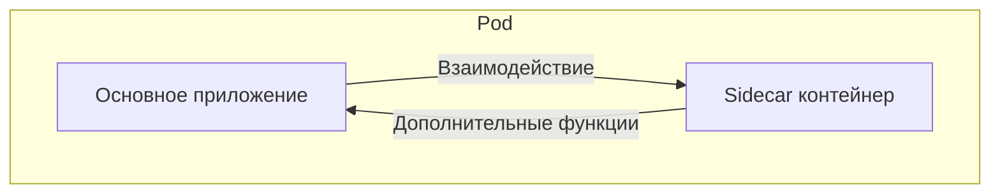
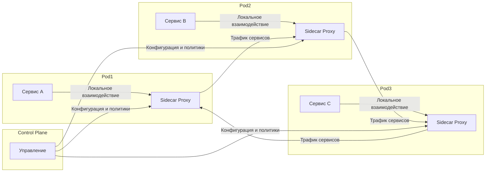
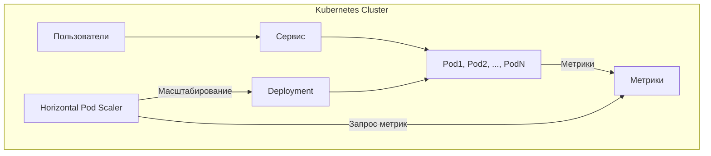

  Разработка Cloud Native приложений на Go

  Евгений Гребенников

  

    {{ new Date().toLocaleDateString('ru-RU', { year: 'numeric', month: 'long', day: 'numeric' }) }}
  

  <a href="https://github.com/vokinneberg/ya-practicum-go-cloud-native-workshop" target="_blank" alt="GitHub" title="Open in GitHub"
    class="text-xl slidev-icon-btn opacity-50 !border-none !hover:text-white">
    <carbon-logo-github />
  </a>

---
layout: two-cols
hideInToc: true
---

## 🤗 Добро пожаловать на вебинар!

Пока мы ожидаем остальных, пожалуйста:

- ✍️ Переименуйтесь в Zoom в формате Имя и Фамилия
- 📹 Если есть возможность, включите Web-камеру

::right::

## План вебинара

<Toc minDepth="1" maxDepth="2" class="text-left" mode="all" />

---
layout: image-right
image: ./cloudnative-apps-what.jpg
title: 🌥️ Почему Cloud Native?
---

## 🌥️ Почему Cloud Native?

<v-click>
  

    

      Cloud Native Is About Culture, Not Containers.
    

    

      Cummins, Holly. Cloud Native London 2018.
    

  

</v-click>

<v-click>
  

    

      Надежность (Dependability) компьютерной системы — это ее способность избегать сбоев, которые более часты или серьезны, а также периодов простоя, которые длиннее, чем это приемлемо для пользователей.
    

    

      Фундаментальные концепции надежности компьютерных систем (2001).
    

  

</v-click>

---
layout: image-right
image: ./cloud-native-attrs.png
hideInToc: true
---

## 🧠 Атрибуты Cloud Native приложения

<v-click>

- **Availability** - Способность системы выполнять свою предназначенную функцию в случайный момент времени.

</v-click>

<v-click>

- **Reliability** - Способность системы выполнять свою предназначенную функцию в течение заданного интервала времени.

</v-click>

<v-click>

- **Maintainability** - Способность системы подвергаться модификациям и ремонту.

</v-click>

---
layout: image-right
class: text-center
image: ./12_factor_apps.png
hideInToc: true
---

  

    ⚡ The Twelve Factors
  

---
layout: two-cols
title: ☸️ Основы разработки в Kubernetes
---

## ☸️ Основы разработки в Kubernetes

<v-click>

  - Стратегия развертывания

</v-click>

<v-click>

  - Настройка

</v-click>

<v-click>

  - Service discovery

</v-click>

<v-click>

  - Балансировка нагрузки и масштабирование

</v-click>

<v-click>

  - Телеметрия

</v-click>

<v-click>

  - Обеспечение безопасности приложения

</v-click>

::right::

---
layout: default
title: 🚀 Продвинутые паттерны развертывания приложений в Kubernetes
---

  

    

      🚀 Продвинутые паттерны развертывания приложений в Kubernetes
    

  

  

    
  

---
layout: default
hideInToc: true
---

## 🚗 Sidecar

Sidecar — это архитектурный подход, при котором в одном поде (Pod) размещаются несколько контейнеров, выполняющих различные, но взаимодополняющие функции.

---
layout: default
hideInToc: true
---

## 🐙 Service Mesh

Service Mesh — это инфраструктурный слой, предназначенный для управления взаимодействиями между микросервисами в распределенных системах.

---
layout: default
hideInToc: true
---

## 🐙 Elastic Scaler

Elastic Scaler — это механизм автоматического масштабирования ресурсов, позволяющий динамически адаптировать количество подов или их ресурсы в зависимости от текущей нагрузки и требований приложения.

---
layout: center
title: 🤔 Вопросы?
---

 ## 🤔 Вопросы?

---
layout: center
title: 📚 Источники
---

## 📚 Источники

- [What is Cloud Native?](https://aws.amazon.com/what-is/cloud-native/)
- [Cloud Native Computing Foundation](https://www.cncf.io/)
- [The Twelve Factors](https://12factor.net/)
- [Red Hat Cloud Native Apps](https://www.redhat.com/en/topics/cloud-native-apps)
- [Cloud Native Go: Building Reliable Services in Unreliable Environments](https://a.co/d/gDIj5SJ)
- [Kubernetes Patterns: Reusable Elements for Designing Cloud Native](https://a.co/d/aRQ3F4X)

<PoweredBySlidev mt-10 />
